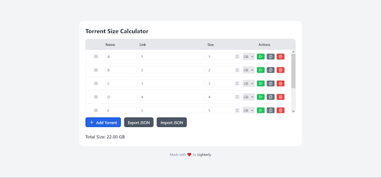

<div align="center">

# 🧲 Torrent Size Calculator

A lightweight, offline-friendly web tool to calculate and organize torrent sizes with a clean, modern interface.

<p align="center">
  
</p>

[**Open the live project**](https://lxghtexe.github.io/torrent-size-calculator/) — use it directly in your browser, no setup required.

</div>

---

## 🚀 Overview

**Torrent Size Calculator** is a small front-end project built with **HTML, Tailwind CSS, and Vanilla JavaScript**. It allows you to list torrents, choose storage units, reorder entries, and instantly see the total size — all **locally**, without sending any data to a server.

The project is designed to be:

* Simple
* Fast
* Offline-first
* Easy to use with mouse **and** keyboard

---

## ✨ Features

* ➕ Add, remove, and duplicate torrent rows
* 📐 Supports multiple storage units (B → BB)
* 🔢 Automatic total size calculation with smart unit scaling
* 🖱️ Drag & drop row reordering with visual indicators
* ⌨️ Keyboard support (Enter, Delete, Alt + ↑ / ↓)
* 💾 Persistent data using `localStorage`
* 📤 Export data to JSON
* 📥 Import data from JSON
* 🧲 Run links (supports `magnet:` and `http(s)` URIs)
* 📱 Clean, responsive layout

---

## 🛠️ Tech Stack

* **HTML5**
* **Tailwind CSS**
* **Vanilla JavaScript**
* **Heroicons**
* **GitHub Pages** (deployment)

No frameworks. No build step. No backend.

---

## 📦 Usage

You can use the project in two ways:

### 1️⃣ Online (recommended)

Open the live version:

👉 [https://lxghtexe.github.io/torrent-size-calculator/](https://lxghtexe.github.io/torrent-size-calculator/)

### 2️⃣ Locally

Clone the repository and open `index.html` in your browser:

```bash
git clone https://github.com/lxghtexe/torrent-size-calculator.git
cd torrent-size-calculator
```

Then simply open `index.html`.

---

## 👨‍💻 Author

Created by **lxghtexe**

Built as a small but polished project focused on usability, interaction, and clean front-end logic.

---

## 📄 License

This project is licensed under the **MIT License**. See the `LICENSE` file for details.

---

<div align="center">

Made with ❤️ in Brazil

</div>
